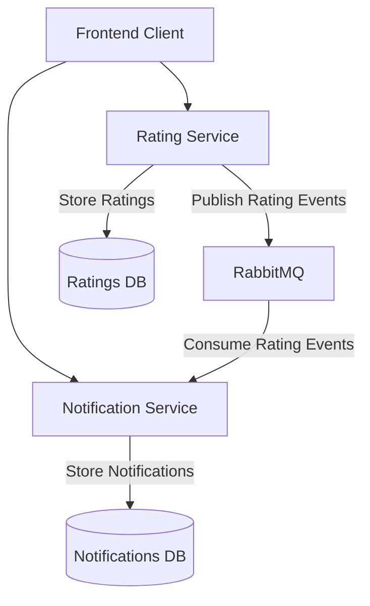

# Service Marketplace - Rating and Notification System

A microservices-based system that enables customers to rate service providers and notifies service providers of new ratings.

## Architecture

The system follows a microservices architecture with event-driven communication between services:

- **Rating Service**: Exposes REST endpoints for submitting and retrieving ratings.
- **Notification Service**: Exposes a REST endpoint for retrieving notifications.
- **RabbitMQ**: Message broker for asynchronous communication between services.
- **SQL Server**: Database for persisting data.

### System Flowchart


## Services
This API provides endpoints for submitting ratings and retrieving ratings for service providers and customers.

# Rating Service API
## **Endpoints**
### **1️⃣ Submit a Rating**
**POST** `/api/ratings`

#### **Request Body**
```json
{
  "serviceProviderId": "<GUID>",
  "customerId": "<GUID>",
  "score": <1-5>,
  "comment": "Optional comment (max 500 characters)"
}
```

#### **Response (201 Created)**
```json
{
  "id": "<GUID>",
  "serviceProviderId": "<GUID>",
  "customerId": "<GUID>",
  "score": 5,
  "comment": "Great service!",
  "createdAt": "2025-03-11T10:00:00Z"
}
```

#### **Errors (400 Bad Request)**
- `"ServiceProviderId and CustomerId cannot be empty GUIDs."`
- `"Rating score must be between 1 and 5."`
- `"Comment must not exceed 500 characters."`

---

### **2️⃣ Get Average Rating for a Service Provider**
**GET** `/api/ratings/{serviceProviderId}/average`

#### **Response (200 OK)**
```json
{
  "serviceProviderId": "<GUID>",
  "averageScore": 4.5,
  "totalRatings": 10
}
```

#### **Errors (400 Bad Request | 404 Not Found)**
- `"Invalid service provider ID format."`
- `"No ratings found for service provider."`

---

### **3️⃣ Get Ratings for a Customer (Paginated)**
**GET** `/api/ratings/customer/{customerId}?page={page}&pageSize={pageSize}`

#### **Response (200 OK)**
```json
{
  "customerId": "<GUID>",
  "ratings": [
    {
      "id": "<GUID>",
      "serviceProviderId": "<GUID>",
      "score": 5,
      "comment": "Excellent service",
      "createdAt": "2025-03-11T10:00:00Z"
    }
  ],
  "currentPage": 1,
  "totalPages": 2
}
```

#### **Errors (400 Bad Request)**
- `"Invalid customer ID format."`
- `"Page number and page size must be greater than zero."`

---

### **4️⃣ Get Average Rating for a Customer**
**GET** `/api/ratings/customer/{customerId}/average`

#### **Response (200 OK)**
```json
{
  "customerId": "<GUID>",
  "averageScore": 4.2,
  "totalRatings": 5
}
```

#### **Errors (400 Bad Request | 404 Not Found)**
- `"Invalid customer ID format."`
- `"No ratings found for customer."`

---

## **🔹 Error Handling**
All error responses follow this format:
```json
{
  "message": "Error description"
}
```

## Notes
- `serviceProviderId` and `customerId` must be **valid GUIDs**.
- Rating **score must be between 1 and 5**.
- `page` and `pageSize` **must be greater than zero**.
- The **average rating is rounded to one decimal place**.

#### Features:
- Persists rating data in SQL Server.
- Publishes events to RabbitMQ when new ratings are created.
- Validates rating scores (1-5 scale).
- Calculates average ratings and total count.

# Notification Service API
## **Endpoints**

### **1️⃣ Get Notifications for a Service Provider (Paginated)**
**GET** `/api/notifications/service-provider/{serviceProviderId}?page={page}&pageSize={pageSize}`

#### **Response (200 OK)**
```json
{
  "notifications": [
    {
      "id": "<GUID>",
      "serviceProviderId": "<GUID>",
      "message": "New rating received!",
      "createdAt": "2025-03-11T10:00:00Z",
      "isRead": false
    }
  ],
  "currentPage": 1,
  "totalPages": 2
}
```

#### **Errors (400 Bad Request | 500 Internal Server Error)**
- `"Invalid service provider ID format."`
- `"Page number and page size must be greater than zero."`
- `"An unexpected error occurred. Please try again later.

---

## **🔹 Error Handling**
All error responses follow this format:
```json
{
  "message": "Error description"
}
```

## Notes
- `serviceProviderId` must be a **valid GUID**.
- `page` and `pageSize` **must be greater than zero**.
- Notifications are **returned only once** and marked as read after retrieval.
- If no notifications exist, an **empty list** is returned instead of `404 Not Found`.

#### Features:
- Consumes rating events from RabbitMQ.
- Creates notifications based on rating events.
- Returns notifications only once (marks them as read).
- Persists notification data in SQL Server.

## Technical Implementation

### Communication Mechanism
The services communicate through an event-driven architecture using RabbitMQ:
- Rating Service publishes a `RatingCreatedEvent` when a new rating is submitted.
- Notification Service subscribes to these events and processes them.

### Data Storage
Both services use their own separate SQL Server databases:
- **RatingDb**: Stores rating data.
- **NotificationDb**: Stores notification data.

### Reliability Considerations
- The RabbitMQ connection is configured for automatic reconnection.
- Message acknowledgment ensures messages aren't lost.
- Database transactions ensure data consistency.
- Retry mechanisms for failed message processing.
- Health check endpoints are used to monitor service health.

## Getting Started

### Prerequisites
- Docker and Docker Compose
- .NET SDK 8.0 (for development)
- SQL Server (provided via Docker)
- RabbitMQ (provided via Docker)

### Running with Docker Compose
```sh
git clone https://github.com/harunu/service-marketplace.git
docker-compose -f docker/docker-compose.yml up -d
```

Verify the services are running:
```sh
curl http://localhost:5001/health  # Rating Service
curl http://localhost:5002/health  # Notification Service
```

### Development Setup
```sh
git clone https://github.com/harunu/service-marketplace.git
docker-compose -f docker/docker-compose.yml up -d rabbitmq sqlserver
```
Run the services individually:
```sh
# Run Rating Service
cd src/RatingService/RatingService.Api
dotnet run

# Run Notification Service
cd src/NotificationService/NotificationService.Api
dotnet run
```

Run the tests:
```sh
dotnet test
```

## API Documentation
Once the services are running, you can access the Swagger documentation:
- Rating Service: [http://localhost:5001/swagger](http://localhost:5001/swagger)
- Notification Service: [http://localhost:5002/swagger](http://localhost:5002/swagger)

## Testing the System

### Submit a Rating
```sh
curl -X POST http://localhost:5001/api/ratings \
  -H "Content-Type: application/json" \
  -d '{"serviceProviderId":"11111111-1111-1111-1111-111111111111","customerId":"22222222-2222-2222-2222-222222222222","score":5,"comment":"Excellent service!"}'
```

### Get Average Rating
```sh
curl http://localhost:5001/api/ratings/11111111-1111-1111-1111-111111111111/average
```

### Get Notifications
```sh
curl http://localhost:5002/api/notifications/service-provider/11111111-1111-1111-1111-111111111111
```

## Potential Improvements

### Authentication and Authorization
- Implement JWT-based authentication.
- Add role-based access control (RBAC).

### Enhanced Reliability
- Implement a Dead Letter Queue (DLQ) for failed messages.

### Scalability
- Deploy to Kubernetes for horizontal scaling.
- Add caching layer for frequently accessed data (e.g., Redis).

### Monitoring and Observability
- Implement distributed tracing (e.g., OpenTelemetry).
- Add application metrics (e.g., New Relic).
- Create comprehensive dashboards (Kibana, New Relic).

### Performance Optimizations
- Add response caching for frequently requested data.
- Consider implementing CQRS pattern.

### Resilience
- Add fallback mechanisms for critical operations.
- Enhance health checks with dependency health monitoring.

## 🚀 Final Notes ##

### **Deployment Strategy**
- Each microservice (**RatingService** and **NotificationService**) should be **deployed separately** to enhance scalability, maintainability, and fault isolation.
- The current setup bundles both services in a single container, with **only NotificationService exposed** for CD simulation.
- **RabbitMQ and RatingService configurations** require additional tuning and are **out of scope** for this iteration.

### **Database Configuration & Security**
- **Database connection strings** and other sensitive data **should never be committed to GitHub**.
- Recommended security best practices:
  - **Azure Key Vault** (for production environments).
  - **Kubernetes Secrets** (for containerized deployments).
  - **Environment Variables** (for runtime configuration).
  - **`secrets.json` in Visual Studio** (for local development) using the **dotnet user-secrets** tool instead of hardcoding credentials in `appsettings.json`.

### **Environment Variable Management**
- The current approach stores **sensitive credentials in configuration files**, which poses a security risk.
- **Best practice:** Utilize **Azure App Configuration** or **Key Vault references in App Service** to dynamically inject values at runtime.

### **Exception Handling & Logging**
- Implement **global exception handling** to ensure all unhandled errors are **properly logged** and managed.
- Improve **observability** with structured logging frameworks such as **Serilog, Application Insights, or New Relic**.

### **Edge Case & Testing Considerations**
- Some **edge cases** might not be covered in the current implementation.
- **Recommended improvements:**
  - Expand **unit tests and integration tests**.
  - Introduce **chaos testing** to simulate real-world failures.

### Preventing Duplicate Ratings 📌

A customer should only rate the same service provider once or limited counts to ensure fair and accurate ratings. If they try to submit another rating, their existing rating should be updated instead of creating a new one. This prevents spam and ensures the average rating remains correct.

### **Azure Authentication & Deployment Security**
- **Azure login and DockerHub credentials** are currently used **for testing purposes only**.
 You can explore the Notification API on Live:  
🔗 **[Swagger UI](https://service-marketplace.jollyfield-e6b398ef.westeurope.azurecontainerapps.io/swagger/index.html)**  
- **For enhanced security:**
  - Use **Managed Identities for Azure Resources** to eliminate hardcoded credentials in CI/CD pipelines.
---


## License
This project is not licensed 

